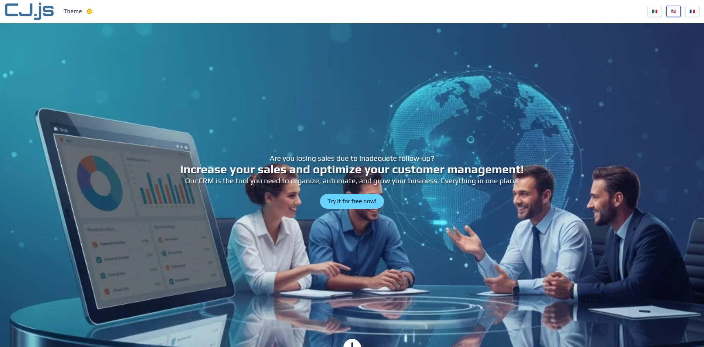

# cj-demo
## CustomerJourney.js Demo App
Demo web application to study and understand the concept of CustomerJourney.js:
1. Your router.
2. Serving pages.
3. Handling examples.
4. The scrollStopping object.
5. And much more.
## Install
 ```bash
npx @customerjourney/create-cj-demo your-app-name
```
## Setup
1. Install the dependencies
2. Start the application

 ```bash
cd your-app-name
npm install
npm run init
```
## Usage
1. go to http://localhost:8000/
2. Enjoy 😊.



3. Review the changes in the console.
4. Review the state changes with your browser's Redux DevTools add-on.

## Scripts
- init: Create the configuration file (required), compile scss and serve the web app in watch mode.
- build: Create the index.js file with the latest changes.
- build:prod: Create the minified index.js file with the latest changes
- dev: Create the index.js file with the latest changes and serve it to the web app in watch mode.
- serve: Serves the web app in its current state.
## Documentation 
- [Get started](https://customerjourney.ninja/getting-started/).
- [Usage Guide](https://customerjourney.ninja/usage-guide/).
## License
j-core is [GPL-3.0-or-later](./LICENSE).
## Sponsor
[Become a CustumerJourney.js Sponsor](https://customerjourney.ninja/sponsor/).

